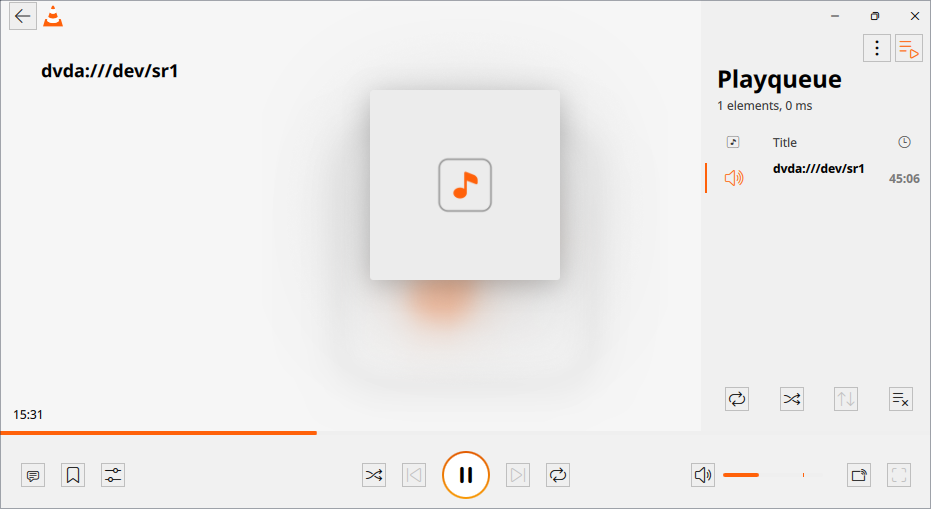
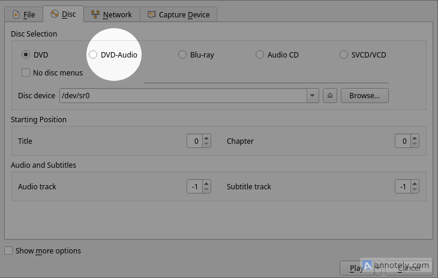

  
  

# GSoC 2025 Final Report  
**VideoLAN – DVD-Audio Deciphering Module in VLC**  
**Author:** Saifelden Mohamed Ismail  
---

## General Information
| **Field** | **Details** |
|-----------|-------------|
| **Organization** | [VideoLAN](https://www.videolan.org/) |
| **Project** | DVD-Audio Deciphering Module in VLC |
| **Mentors** | Jean-Baptiste Kempf, Steve Lhomme |
| **Proposal Link** | [Available here](https://summerofcode.withgoogle.com/programs/2025/projects/db95jRqT) |

---

## Abstract
This project's initial aim was to add CPPM decryption support into VLC. However, more was required to support the DVD-Audio format, so the initial aims were expanded upon. The final deliverables were updates to `libdvdread` to support the DVD-Audio format, `libdvdcss` for the decryption support, as well as a submodule for simple playback in VLC.

---

## Goals
- Provide a public API to read CPPM encrypted DVD-Audio blocks in `libdvdcss`.
- Provide a public API to change `libdvdread`'s behavior to read DVD-Audio discs.
- Provide a way for the user to play encrypted DVD-Audio discs directly in VLC.

---

## Work Completed and Results
VLC now supports simple audio title-based playback on encrypted DVD-Audio discs without the need to extract the audio data. This makes VLC one of the only ways to play this type of disc as-is. Both `libdvdread` and `libdvdcss` have been extended to support DVD-Audio features (IFO files, path structures, etc.) in an OS-agnostic way. These additions were tested and validated on the following discs:

1. Deep Purple – *Machine Head* (encrypted)
2. *Brain Salad Surgery* (unencrypted)
3. Fleetwood Mac – *Say You Will* (encrypted)
4. Eagles – *Hotel California* (encrypted)

|  |  |
|---------------------------------------|----------------------------------------|
| *DVD-Audio Disc Playback*             | *Addition to Disc Menu*                |

---

## Merge Requests

| Project      | +    | -    | Description                                           | Link |
|--------------|------|------|-------------------------------------------------------|------|
| **libdvdread** | 1205 | 133  | Initial DVD-Audio additions                           | [link](https://code.videolan.org/videolan/libdvdread/-/merge_requests/49) |
|              | 20   | 7    | Follow-up adjustments/fixes                           | [link](https://code.videolan.org/videolan/libdvdread/-/merge_requests/51) |
|              | 95   | 73   | Follow-up adjustments/fixes                           | [link](https://code.videolan.org/videolan/libdvdread/-/merge_requests/58) |
|              | 77   | 5    | Follow-up adjustments/fixes                           | [link](https://code.videolan.org/videolan/libdvdread/-/merge_requests/59) |
| **libdvdcss**  | 1492 | 9    | Initial CPPM support integration                      | [link](https://code.videolan.org/videolan/libdvdcss/-/merge_requests/13) |
| **vlc**        | y    | x    | DVD-Audio disc menu addition and submodule            | [link](https://code.videolan.org/videolan/vlc/-/merge_requests/7542) |

---

## Challenges
This topic is heavily undocumented, and the available resources are often poorly explained or contain errors. Much of the effort was spent manually analyzing the format to replicate the desired behaviors. There was also initial trouble acquiring material to work on, though discs were generously provided by the foundation.

The DVD libraries are also not as well documented as other pieces of software in VLC, so there was initial friction in understanding how they worked and how to extend them without breaking the API.

Once the initial research phase was completed, the remainder of the project ran more smoothly, though reorganizing my commits to fit VLC code standards was very time-consuming.

---

## Future Work
Support for hybrid disc behavior with video linking titles is not yet implemented, nor is DVD-Audio menu integration similar to that in `libdvdnav`. The information required to implement these features is currently unavailable and undocumented in the unofficial specifications. Exposing still images to the API should also be added, as the unofficial specifications indicate these are included in the Audio Still Video Set (ASVS).

---

## Acknowledgements
I would like to thank both of my mentors for their patience and time, and the foundation for providing me with difficult-to-access material for my work. This wouldn't have been possible without their guidance and support.

---

*This work was completed as part of Google Summer of Code 2025 with VideoLAN.*
